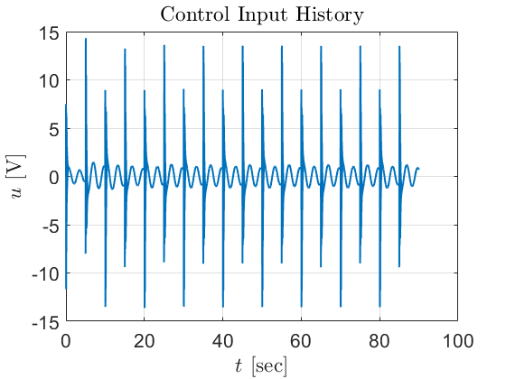
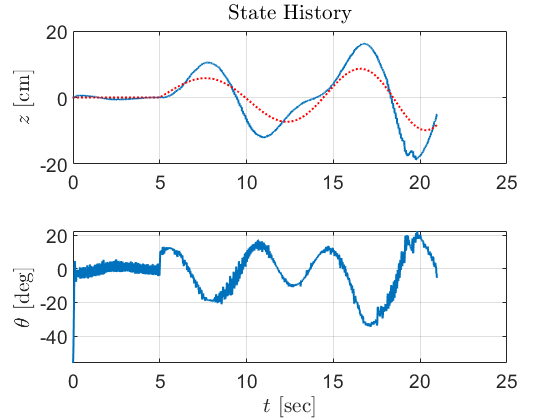

# Feedback Linearization + LQR Controller Plots

## FL-LQR Simulation Video

<video controls src="FL-LQR-Controller/FL-LQR-simulator-tracking.mp4" title="FL-LQR Simulator Tracking"></video>

## Square Wave Reference Tracking (Simulation)

### Tracking Plot

### Output Error

### Control Input History

## Sine Wave Reference Tracking (Simulation)

### Tracking Plot

### Output Error

### Control Input History

## Hardware Experiment Results

### Tracking Plot

### Output Error

### Control Input History
