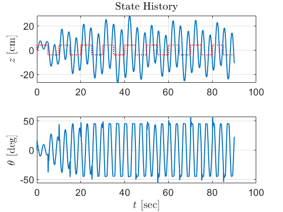
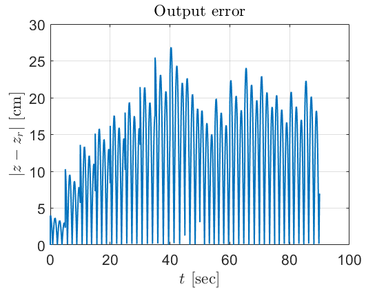
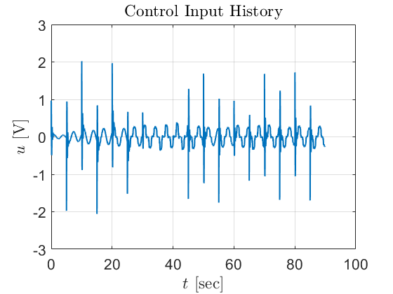
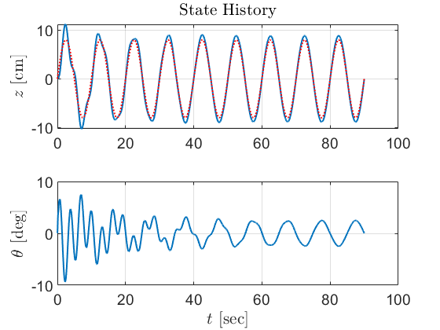
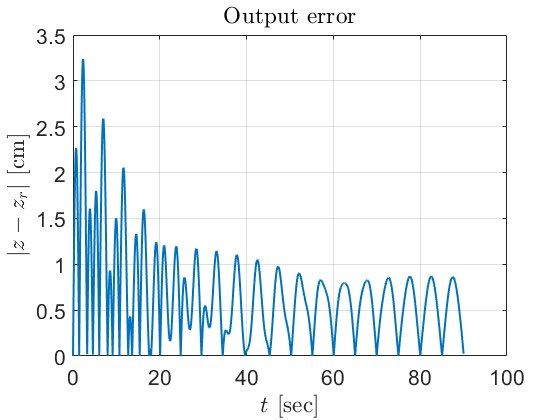
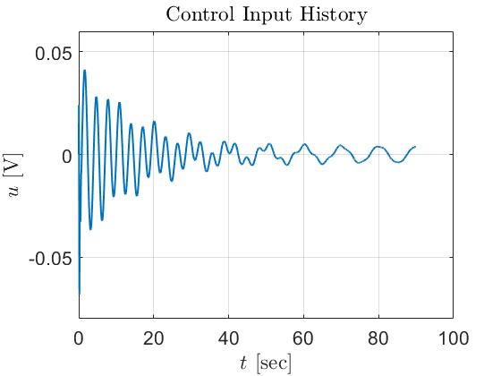
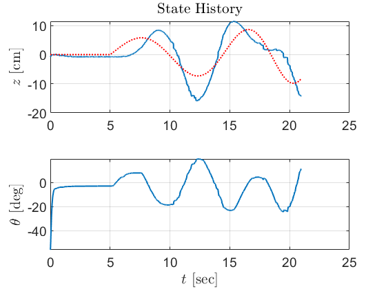
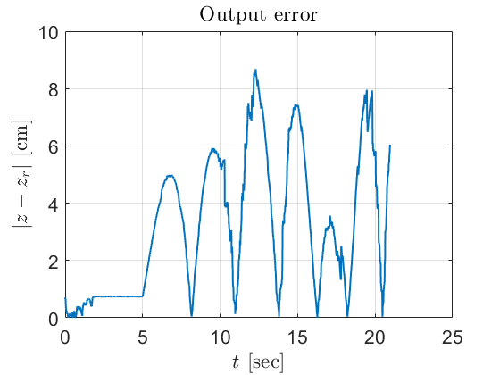
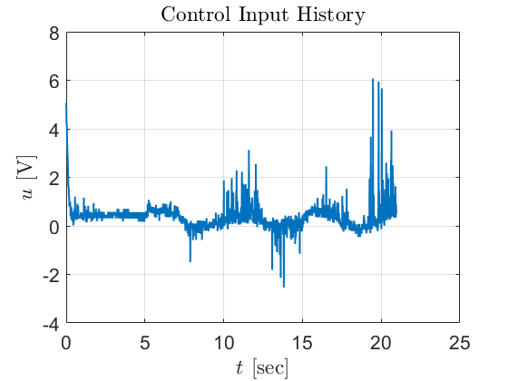

# PID Controller Plots

## PID Simulation Video

<video controls src="PID-Controller-Plots/PID-simulator-tracking.mp4" title="PID Simulator Tracking"></video>

## Square Wave Reference Tracking (Simulation)

### Tracking Plot

### Output Error

### Control Input History

## Sine Wave Reference Tracking (Simulation)

### Tracking Plot

### Output Error

### Control Input History

## Hardware Experiment Results

### Tracking Plot

### Output Error

### Control Input History

